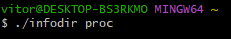

# Infodir-IPC-e-Multithread
Projeto feito como segundo trabalho pratico da disciplina de sistemas operacionais.
Segundo periodo do curso de tecnologia em sistemas para internet

# Dados do projeto

 Desenvolva um programa chamado infodir para calcular o número total de arquivos, subdiretórios
e o tamanho total, em bytes, dos arquivos de um diretório, incluindo todos os arquivos dos
subdiretórios. Considerando o exemplo da figura abaixo, se o diretório informado pelo usuário for
proc, o programa deve exibir como resultado o seguinte: 

  <em>
    Arquivos = 6  
    Subdiretórios = 2  
    Tamanho do diretório = 56.328 bytes
  </em>

  <ol>
    <li> O usuário digita na linha de comando do sistema operacional o nome do programa infodir e
      passa como argumento o diretório que ele deseja obter os dados, como no exemplo abaixo.  
      
      </li>
        <li> Para cada subdiretório que o programa infodir (processo pai) encontrar no diretório deve-se
criar um processo filho para calcular o número total de arquivos, subdiretórios e o tamanho
total dos arquivos do diretório, incluindo todos os arquivos dos subdiretórios. É função do
infodir (processo pai) apenas ler o conteúdo do diretório informado pelo usuário, criar os
processos filhos e exibir os relatórios abaixo com os resultados do programa. Se o diretório não
possuir nenhum subdiretório, apenas arquivos, o infodir deve criar um único processo filho para
realizar os cálculos.  
      </li>
        <li> O processo pai deve compartilhar uma região de memória com os processos filhos. Essa área
de memória será usada pelos processos filhos escreverem o número total de arquivos,
subdiretórios e o tamanho total calculado dos subdiretórios. O processo pai deve acessar essa2 / 4
área de memória, após a conclusão dos processos filhos, para somar todos esses valores de
cada subdiretório de modo a obter a quantidade total de arquivos, diretórios e o tamanho do
diretório.
      </li>
        <li> O infodir antes de acessar o diretório para ler o seu conteúdo e de iniciar a criação do(s)
processo(s) filho(s), deve obter o tempo inicial e após calcular a quantidade total de arquivos,
diretórios e o tamanho do diretório, exibir o tempo final e o tempo gasto para realizar esses
cálculos. O resultado desse processamento deve ser exibido em um relatório com o seguinte
leiaute:

 <em> - <strong>Método: IPC - Interprocess Communication</strong> 
- Diretório: /home/ 
- <strong>Conteúdo do diretório</strong> 
Arquivos = 6 
Subdiretórios = 2 
Tamanho do diretório = 56.328 bytes 
- <strong>Tempo usando IPC</strong> 
Início.....: 14:25:35 
Término: 14:25:59 
   Duração: 24 segundos</em> 
          

O programa deve exibir o tempo de início e término no formato hh:mm:ss e a duração em
segundos.
      </li>
    
   <li>
             Após exibir o relatório usando o método de comunicação entre processos (memória
compartilhada), o infodir deve repetir os passos 2 a 4 mas usando outro método para calcular o
número total de arquivos, subdiretórios e o tamanho total dos arquivos de um diretório. Esse
método é a criação de múltiplas threads (multithread). Para cada subdiretório que o programa
encontrar no diretório deve-se criar uma thread. Uma região de memória do processo deve ser
compartilhada com suas threads. Essa área de memória será usada pelas threads para
escreverem o número total de arquivos, subdiretórios e o tamanho total calculado dos
subdiretórios. O processo deve acessar essa área de memória, após a conclusão das threads,
para somar todos esses valores de cada subdiretório de modo a obter a quantidade total de
arquivos, diretórios e o tamanho do diretório.
    </li>    
  </ol>

